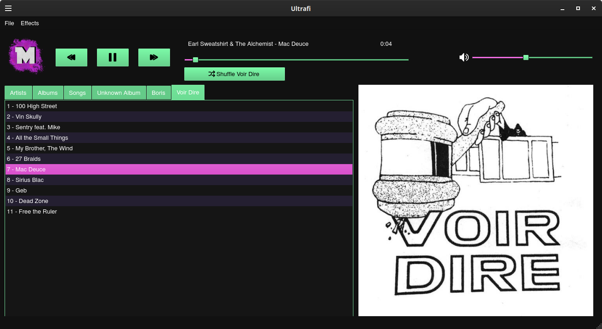

# Ultrafi

Ultrafi is a music player app for linux that was built using qt. You can build it by opening Ultrafi.pro in qt creator. It allows you to view your music library by artists, albums or songs. It is able to display the album covers, and it includes the ability to shuffle music. 

I am currently working on adding audio effects such as reverb, eq, and delay. I will also be adding the ability to add songs to your library from a youtube link using youtube-dl.
